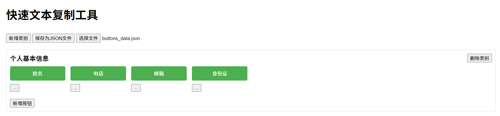

# 快速文本复制工具

## 作者
- Name: Witheart
- Email: witheart.yinjim@qq.com
- Blog: [https://blog.csdn.net/Beihai_Van](https://blog.csdn.net/Beihai_Van)

## 项目简介

该项目是一个基于 HTML、CSS 和 JavaScript 的简单网页应用，旨在帮助用户通过点击按钮快速将绑定的文本复制到剪贴板。

用户可以：
- 新增类别和按钮
- 管理按钮的顺序（上移、下移）
- 保存当前数据为 JSON 文件
- 从 JSON 文件加载数据
- 通过点击按钮快速复制文本

## 功能特性

1. **新增类别**：用户可以通过点击“新增类别”按钮，输入类别名称来添加新的类别。
2. **新增按钮**：用户可以在每个类别中添加按钮，并为每个按钮绑定文本。点击按钮后，文本将会被复制到剪贴板。
3. **按钮管理**：每个按钮旁边的菜单允许用户上移、下移或删除按钮。
4. **删除类别**：每个类别的右上角有删除按钮，点击后可以删除整个类别及其包含的所有按钮。
5. **保存和加载数据**：
   - 用户可以将当前的类别和按钮数据保存为 JSON 文件。
   - 用户也可以从本地加载 JSON 文件，并将数据恢复到页面中。

## 文件结构

```bash
.
├── QuickTextCopy.html        # 主 HTML 文件
├── styles.css        # 自定义的外部样式表
└── README.md         # 项目说明文档
```

## 使用说明

### 1. 打开项目

直接在浏览器中打开 `QuickTextCopy.html` 文件即可运行该工具。

### 2. 新增类别

点击页面顶部的 **新增类别** 按钮，输入类别名称后，新的类别会被添加到页面中。

### 3. 新增按钮

在每个类别中，点击 **新增按钮** 按钮，输入按钮名称与关联的文本，即可为该类别添加按钮。

### 4. 复制文本

点击按钮后，按钮所绑定的文本会自动复制到剪贴板。

### 5. 调整按钮顺序或删除按钮

每个按钮旁的“...”菜单提供了以下选项：
- **上移** 按钮位置
- **下移** 按钮位置
- **删除** 按钮

### 6. 删除类别

点击类别右侧的 **删除类别** 按钮可以删除整个类别及其下的所有按钮。

### 7. 保存数据为 JSON 文件

点击 **保存为JSON文件** 按钮，当前页面的所有数据会被保存为一个 `.json` 文件，方便下次加载。

### 8. 加载 JSON 数据

点击 **加载JSON文件** 按钮，选择一个本地的 JSON 文件，数据将会被加载到页面中，替换当前的类别和按钮。

## 相关技术栈

- **HTML**：用于定义页面结构。
- **CSS**：用于页面的样式和布局设计。
- **JavaScript**：负责页面的交互逻辑和功能实现。

## 开发和修改

1. **克隆项目**：
   ```bash
   git clone https://github.com/your-repo/quick-text-copy-tool.git
   ```

2. **修改样式**：
   - 所有的样式定义在 `styles.css` 文件中，可以根据需要修改页面的外观。

3. **修改功能**：
   - 所有的功能逻辑都在 `QuickTextCopy.html` 文件内的 `<script>` 标签中，使用原生 JavaScript 实现。

## 注意事项

- 请确保加载的 JSON 文件格式正确，文件内容应与已保存的 JSON 格式一致，否则可能无法正常加载数据。
- 该工具依赖于浏览器的剪贴板 API，确保浏览器支持该功能。

## 示例截图

